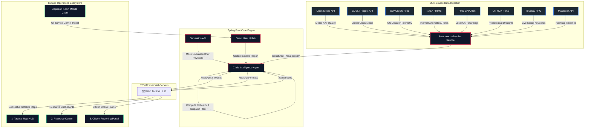

# 🛡️ Nigehban AI
### *Autonomous National Crisis Intelligence & Resource Mobilization Platform*

> [!NOTE]
> **Nigehban AI** (formerly AegisNet) was built for the **Google AI Hackathon**. It represents a state-of-the-art emergency operations paradigm that coordinates autonomous multi-spectrum intelligence feeds (Meteo, GDELT, social streams) to intercept, classify, and mitigate national crises across Pakistan.

---

## 🌍 Overall System Design & Architecture

Nigehban AI operates as a decoupled, real-time, event-driven ecosystem composed of a **Spring Boot Reasoning Engine**, a keyless **Multi-Spectral Ingestion Swarm**, and real-time **Tactical HUDS (Angular Web + Kotlin Mobile App)**:



For a comprehensive architectural breakdown and code-level walkthroughs, please refer to the main documentation:
👉 **[Nigehban AI Engineering Documentation](file:///c:/Users/ATECH/AegisNet-AI---Google-AI-Hackathon-/docs/Nigehban_AI_Documentation.md)**

---

## 🧠 The Multi-Agent Orchestration Swarm

The platform aggregates noisy global data by orchestrating **six distinct autonomous agents** running on dedicated threads:

1. **Agent 1 (Meteorological & Environmental)**: Polls Open-Meteo every 30s. Monitors temperatures, flash floods (river flow discharges), cyclones, and PM2.5 air quality indexes.
2. **Agent 3 (News Intelligence)**: Polls the GDELT Project every 90s, translating raw media reports into classified geopolitical/infrastructural threats.
3. **Agent 4 (Decentralized Social Signals)**: Scrapes Bluesky and Mastodon public timelines every 60s to identify rapid localized incident spikes.
4. **Agent 5 (Advanced Technical Intelligence)**: Cross-references NASA FIRMS fire models, PMD CAP advisories, and UN/OCHA HDX hydrological data every 120s.
5. **Agent 6 (Global Tectonic Disasters)**: Pulls GDACS feeds every 5m to verify high-magnitude seismic epicenters.
6. **Central EOC Reasoning Agent**: Computes dynamic criticality metrics, estimates affected populations, maps emergencies to the Pakistan National Hazard Taxonomy, and structures automated ground dispatch plans.

---

## 📡 Keyless API Integration Matrix

The ingestion layer runs on keyless, unauthenticated real-time channels combined with automatic, high-fidelity mock fallbacks to guarantee absolute uptime:

*   **Real APIs Used**:
    *   **Open-Meteo** (`api.open-meteo.com`)
    *   **GDACS EU Joint Research Centre Feed** (`gdacs.org/xml/rss.xml`)
    *   **Bluesky Social search** (`public.api.bsky.app/xrpc/app.bsky.feed.searchPosts`)
    *   **Mastodon tag timelines** (`mastodon.social/api/v1/timelines/tag/:tag`)
    *   **NASA FIRMS, PMD CAP, and UN/OCHA HDX** open feeds.
*   **Mock & Fallback APIs**:
    *   **GDELT Fallback**: GDELT frequently rate-limits (HTTP 429). `GdeltService.java` automatically catches connection errors and injects a Pakistan-specific taxonomic news database (e.g. Gilgit Glacial Lake Outburst Floods, Sukkur Dam failures) to guarantee system execution.
    *   **Simulation Injections**: `/api/simulation/weather` and `/api/simulation/social` allow instant manual demo triggers representing extreme weather alerts and social panic posts.
    *   **Citizen Uplink REST Portal**: `/api/simulation/report` receives direct JSON coordinates from the Angular Web Reporting tab or Android Kotlin client, immediately generating pulsing warning rings on the map.

---

## 🛠️ Technology Stack

*   **Reasoning Engine**: Java 21, Spring Boot, Spring WebSockets (STOMP), SockJS, Maven, Lombok
*   **Tactical HUD (Web)**: Angular 17, TailwindCSS (Dark Mode), Leaflet Spatial Engine, RxJS, SockJS-Client, StompJS
*   **Mobile Interface**: Android, Kotlin, Jetpack Compose, On-Device Gemini Nano Integration

---

## 🚀 How to Run Locally

### 1. Launch Backend Engine
```bash
cd backend
# Set Java 21 runtime
export JAVA_HOME="/path/to/your/jdk-21"
mvn spring-boot:run
```
*The Tomcat container boots on **port 8080** and launches the monitor polling cycles.*

### 2. Launch Tactical Web HUD
```bash
cd frontend
npm install
npm start
```
*The dashboard will compile and open at **`http://localhost:4200`** with real-time websocket synchronization.*

### 3. Launch Mobile Companion Client
1. Open the `/mobile` directory in Android Studio.
2. Build and run the project in an emulator or active hardware.
