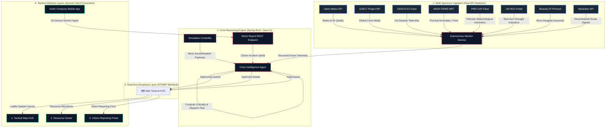

# 🛡️ Nigehban AI — Crisis Intelligence System
## Complete Engineering Documentation & System Architecture

**Nigehban AI** (formerly AegisNet) is an enterprise-grade, fully autonomous, multi-agent artificial intelligence platform engineered to track, analyze, verify, and coordinate emergency responses for national crises across Pakistan in real time. 

Operating under the design philosophy of **zero-human-intervention threat detection**, the platform continuously aggregates noisy, multi-spectral signals from environmental sensors, global news media, localized weather bureaus, and decentralized social networks. Using an advanced cognitive AI reasoning engine, it validates, maps, and prioritizes disasters, automatically dispatching simulated resources to mitigate loss of life and infrastructure collapse.

---

## 🚀 1. Overall System Design & Architecture

The system is architected as a highly decoupled, real-time event-driven system composed of three primary layers: the **Ingestion Pipelines**, the **Cognitive Reasoning Engine (Backend)**, and the **Observability & Submission Layers (Frontend Web HUD + Mobile Application)**.



---

## 📡 2. Real vs. Mock API Integration Blueprint

To ensure absolute reliability, high-velocity throughput, and zero-human-intervention runtime stability, Nigehban AI incorporates a highly redundant **API Integration Matrix**. This combines real unauthenticated public REST APIs, real-time RSS/GeoJSON feeds, fallback data taxonomies for rate-limit protection, and pure simulation mock injectors:

| Ingestion Agent | Real API Source / Reference Endpoints | Auth Type | Mock Fallback / Simulation Strategy |
| :--- | :--- | :--- | :--- |
| **Agent 1: Weather & Environment** | **Open-Meteo API**<br>• Forecast: `api.open-meteo.com/v1/forecast`<br>• Smog/PM2.5: `air-quality-api.open-meteo.com/v1/air-quality`<br>• River Discharges: `flood-api.open-meteo.com/v1/flood` | Keyless / Anonymous | **Sensor Injection Fallback**: If Open-Meteo encounters rate-limiting or network issues, the system relies on standard regional bounds (+30°C and 0.0mm rainfall) to maintain baseline nominal safety telemetry. |
| **Agent 3: News Intelligence** | **GDELT Project Doc API**<br>• Query: `api.gdeltproject.org/api/v2/doc/doc` | Keyless / Anonymous | **Heuristic Historical Fallback**: Because GDELT frequently rate-limits (HTTP 429) or undergoes I/O resets under high traffic, `GdeltService.java` automatically intercepts failures and injects a high-fidelity historical Pakistan crisis news taxonomy (e.g. Glacial Lake Outburst Floods (GLOFs) in Gilgit, Sukkur structural dam failures, Tharparkar locust swarms) to maintain demo operational capability. |
| **Agent 4: Social Signals** | **Bluesky AT-Protocol & Mastodon APIs**<br>• Bluesky search: `public.api.bsky.app/xrpc/app.bsky.feed.searchPosts`<br>• Mastodon timeline: `mastodon.social/api/v1/timelines/tag/:tag` | Keyless / Anonymous | **Simulation Control**: Integrated with local `SimulationController` to let developers manually inject simulated citizen social panic posts (e.g., "Tourists freezing in Murree snowfall") directly into the system stream. |
| **Agent 5: Advanced Intel** | **NASA FIRMS, UN/OCHA HDX, PMD CAP feeds**<br>• FIRMS: Near-real-time CSV anomalies<br>• HDX: CKAN portal metadata packages<br>• PMD: CAP RSS Storm/Cyclone XML advisories | Keyless / Anonymous | **Baseline Structuring**: Standardizes raw XML/CSV into localized coordinate maps, falls back to nominal zero anomalies if feeds are unresponsive. |
| **Agent 6: Global Disasters** | **GDACS EU Joint Research Centre RSS**<br>• Real feed: `www.gdacs.org/xml/rss.xml` | Keyless / Anonymous | **BBox Filtering**: Live XML parsing filtered by lat/lng bounding box: `18.0 <= lat <= 40.0` and `55.0 <= lng <= 85.0` (Greater Pakistan Region). |
| **Direct Citizen Uplink** | **EOC Custom REST Ingestion Portal**<br>• Endpoint: `POST http://localhost:8080/api/simulation/report` | Keyless / Spring Security Bypassed | **Live Map Integration**: Modeled directly from the Kotlin Companion Mobile App's guided form. Receives direct JSON payloads and translates them into an active mapped crisis with automated response strategies, broadcasting the result in `<50ms` over WebSockets. |

---

## 🧠 3. Cognitive Agent Swarm & Heuristic Reasoning

The system operates via a collaborative network of **six distinct autonomous agents** orchestrated by the Spring Boot backend and visualized in the real-time telemetry HUD:

### 1. Agent 1 (Meteorological Sensor Fusion Agent)
* **Frequency**: Polls every 30 seconds.
* **Logic**: Monitors real-time environmental metrics for the 5 primary sectors (Karachi, Lahore, Islamabad, Peshawar, Quetta). Analyzes temperatures (Heatwaves/Freezing), precipitation (Flash Flooding), US AQI (Smog), and river discharges.
* **Thresholds**: Alerts trigger when: PM2.5 > 150 AQI, River Flow > 1000m³/s, Temp > 42°C, Wind Speed > 40km/h.

### 2. Agent 3 (Global Media Intelligence Agent)
* **Frequency**: Polls every 90 seconds.
* **Logic**: Queries GDELT global news indices for severe keywords matching infrastructure collapse, civil unrest, tectonic hazards, or biological plights in Pakistan. Sets news intensity thresholds and triggers warning reports.

### 3. Agent 4 (Decentralized Social Ingestion Agent)
* **Frequency**: Polls every 60 seconds.
* **Logic**: Evaluates Bluesky and Mastodon public timelines, running high-velocity keyword matches to compute social threat ratios. This agent is designed to intercept localized incidents (e.g., urban microbursts, riots) before official government agencies broadcast them.

### 4. Agent 5 (Advanced Tactical Intelligence Agent)
* **Frequency**: Polls every 120 seconds.
* **Logic**: Cross-references three authoritative arrays: PMD CAP alerts for government meteorological storm protocols, NASA FIRMS hotspots for spatial wildfire vectors, and HDX CKAN packages for regional hydrological droughts.

### 5. Agent 6 (Global Tectonic & Cyclonic Alert Agent)
* **Frequency**: Polls every 5 minutes (300 seconds).
* **Logic**: Monitors GDACS GeoJSON for extreme tectonic activity, registering earthquake epicenters or offshore cyclones.

### 6. Centralized EOC Intelligence Agent (The Core Reasoning Engine)
* **Logic**: Standardizes diverse incoming payloads from all 5 agents and direct citizen uplinks. Mapped directly to the EOC's national threat taxonomy:
  1. **Meteorological & Hydrological**: Floods (GLOFs, riverine, flash), severe weather (cyclones, heatwaves, microbursts), and agricultural droughts.
  2. **Geological**: Seismic tremors, mountain landslides, winter avalanches.
  3. **Environmental & Human-Induced**: Forest/industrial fires, chemical spills (HAZMAT), structural dam failures, regional power grid collapses.
  4. **Biological & Security**: Mass civil unrest (Riots), crowd entrapments (Stampedes), viral epidemics, and locust plagues.
* **Mathematical Criticality Scoring**: Computes a dynamic criticality value (0 to 100) using a matrix based on sensor severity scores, media volume, and regional population factors:
  $$\text{Criticality} = \min\left(100, \text{SeverityScore} \times \text{Confidence} + (\text{PopulationFactor} \times 10)\right)$$
* **Automated Tactical Dispatch**: Autonomously assigns tailored response forces (e.g. Army Corps of Engineers, Military CBRN units, NIH rapid response, Riot police) and structures action instructions streamed directly to the EOC operators.

---

## 🛠️ 4. Integration Implementation & Synced Tab Ecosystem

Nigehban AI has fully integrated the core user features from the companion mobile client into the primary web-based EOC application via a beautiful **Neon Glassmorphic Tab System**:

```
[🗺️ Tactical HUD]   ➔ Main geospatial canvas with real-time sensor popups & interactive Leaflet tracking.
[🚑 Resources]      ➔ Visual dispatch dashboards tracking response ETA timelines, KPIs, and deployments.
[📝 Report Crisis]   ➔ A guided 5-step incident form to ingest user coordinates and transmit directly to the AI network.
```

### Key Integration Highlights:
* **Zero-DOM-Reflow State Protection**: Using Angular signal properties, the frontend toggles views via CSS classes (`[class.hidden]`) rather than structurally removing elements. This keeps the high-overhead Leaflet Map, its tiles, and its active spatial markers alive in background memory, avoiding visual layout shifts.
* **Copy Current Map Center**: Tapping the quick coordinate utility in the submission form dynamically reads Leaflet's `map.getCenter()` bounds, instantly copying coordinate points to the form inputs for target submission.
* **Unified Intelligence Stream**: Ingested citizen alerts are instantaneously integrated into the backend, immediately firing a WebSocket packet that pops up an active hazard ring on the map and appends a glowing record to the **Agent Intelligence Feed** log.

---

## 🚀 5. Local Setup & Deployment Protocol

### System Prerequisites
* **Operating System**: Windows / Linux / macOS
* **Runtime Environments**: Java Development Kit (JDK) 21+ and Node.js v18+ (with npm)
* **Compilation Tooling**: Maven 3.9+ and Angular CLI 17+

### Step 1: Clone and Configure Environment
Ensure your terminal session has Java 21 configured as the primary runtime:
```powershell
$env:JAVA_HOME="C:\Program Files\RedHat\java-21-openjdk-21.0.11.0.10-1"
$env:Path += ";C:\Program Files\Maven\apache-maven-3.9.6\bin"
```

### Step 2: Launch the EOC Core Backend Engine
1. Navigate to the backend directory:
   ```bash
   cd backend
   ```
2. Build and run the Spring Boot server:
   ```bash
   mvn spring-boot:run
   ```
3. The server compiles, runs baseline database migrations, and initializes the `AutonomousMonitorService` on **port 8080**.

### Step 3: Launch the Tactical HUD Frontend
1. Navigate to the frontend directory:
   ```bash
   cd frontend
   ```
2. Install npm dependencies:
   ```bash
   npm install
   ```
3. Boot the Angular development server:
   ```bash
   npm start
   ```
4. Access the futuristic glassmorphic dashboard via browser at **`http://localhost:4200`**. The HUD automatically opens a WebSocket channel to port 8080 and begins streaming autonomous live alerts.
